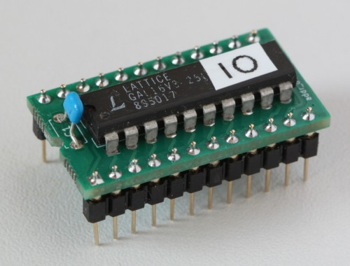

# Address decoder PROM replacement for Elwro 800 

Elwro 800 Junior uses SN74S474 PROMs as IO and memory address decoders. These PROMs are hard to get (and program), this project is a GAL16V8 replacement.

 
